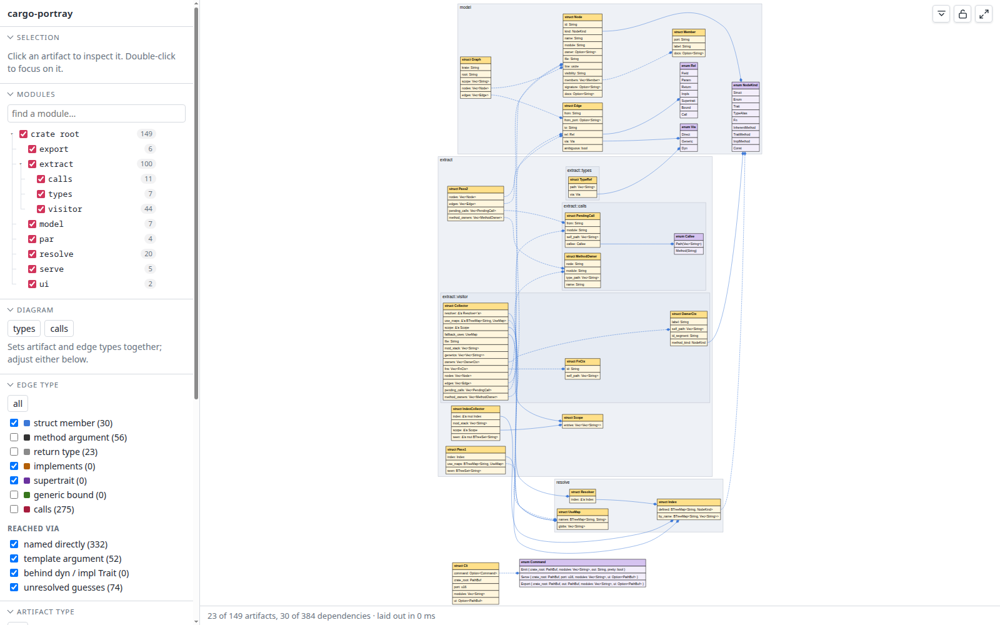

# cargo-portray

[](LICENSE)
[](https://github.com/wilversings/cargo-portray/actions/workflows/deploy-pages.yml)
[](https://github.com/wilversings/cargo-portray/commits/master)

A map of your crate, in your browser: which struct holds which enum, which
function takes which type, who implements what, and what calls what — drawn,
filtered, and clickable.

```sh
cargo install cargo-portray
cargo portray                 # then open the URL it prints
```



**[Live demo](https://wilversings.github.io/cargo-portray/)** — this crate's own graph, exported and hosted with `cargo portray export`.

Filters live in the browser and the current view is in the URL, so a diagram is
a link you can paste, and the back button undoes a filter change.

## Commands

```sh
cargo portray <crate-root>                       # the viewer, with live reload
cargo portray serve  <crate-root> --port 7878
cargo portray serve  <crate-root> --host 0.0.0.0    # reachable off this machine
cargo portray emit   <crate-root> -o graph.json --pretty
cargo portray export <crate-root> -o site
cargo portray serve  <crate-root> -m parser -m codegen
```

`serve` is the default subcommand, so `cargo portray` and `cargo portray serve .`
are the same thing. The crate is named `cargo-portray` because that is how cargo
dispatches; you never type the hyphen. From a checkout of this repo, run it
through cargo with a `--` separator, which is what tells cargo the rest of the
line is not for it:

```sh
cargo run -- serve /path/to/some/crate
```

`serve` watches the crate's `src` and redraws the page about a second after you
save.

## Crates too big to read at once

`--module` (or `-m`, repeatable) narrows what the tool *reads*. With
`-m parser`, only `src/parser.rs`, `src/parser/**` and any inline `mod parser`
are opened at all — nothing else is parsed, indexed or emitted, so a crate of
ten thousand files costs what its one interesting module costs. Either spelling
works, `parser::lexer` or `parser/lexer`, and the page says which scope it is
showing beside the crate name.

This is the one setting that is not a browser filter, deliberately: a filter
should be a click, but what gets *opened* has to be decided before anything is
read. The trade is that inside a scope the rest of the crate is as invisible as
another crate entirely — a type defined outside it does not resolve, and no edge
points at it. To see the whole picture with less drawn, read the whole crate and
switch modules off in the sidebar.

## Hosting it

`export` writes a directory that needs no server of ours:

```sh
cargo portray export . -o site
python3 -m http.server --directory site     # not file://, browsers block the JSON fetch
```

The model lands beside the page as `graph.json` and one `<meta>` tag in
`index.html` points at it; everything else is copied byte for byte. The hosted
viewer *is* the local one — every filter, the module tree, the colour pickers,
the light/dark switch, the DOT/SVG/PNG buttons — because all of that always ran
in the browser. The one thing it cannot do is notice a source file changing.
About a megabyte all in, most of it Graphviz.

For GitHub Pages, with **Settings → Pages → Source** set to *GitHub Actions*:

```yaml
# .github/workflows/pages.yml
name: pages
on:
  push:
    branches: [main]
permissions:
  contents: read
  pages: write
  id-token: write
jobs:
  build:
    runs-on: ubuntu-latest
    steps:
      - uses: actions/checkout@v4
      - run: cargo install cargo-portray && cargo portray export . -o site
      - uses: actions/upload-pages-artifact@v3
        with:
          path: site
  deploy:
    needs: build
    runs-on: ubuntu-latest
    environment:
      name: github-pages
      url: ${{ steps.deployment.outputs.page_url }}
    steps:
      - id: deployment
        uses: actions/deploy-pages@v4
```

Every link the page emits is relative, so it works from a project page at
`user.github.io/repo/` as well as from a domain root or a subdirectory of one,
and a `.nojekyll` file is dropped in too. One trap: **a repository has exactly
one Pages site.** If something else already deploys Pages there, a second job
calling `deploy-pages` replaces the whole site rather than adding to it. Export
into a subdirectory of the tree that job already uploads instead.

## How it decides what depends on what

Syntax only — there is no type checker here. Two things make that trustworthy
enough to act on.

**Names are resolved, not matched.** A short name is looked up in the module
that wrote it, then in that module's `use` statements, then in a crate-wide
index. Two modules can both define `Error` without collapsing into one node.
When a name genuinely cannot be pinned down, the edge is still drawn but flagged
as a guess, and the viewer can hide those.

**Positions are kept.** `Vec<Foo>` records `Foo` as a template argument,
`Box<dyn Foo>` as a trait object, `&Foo` as a plain direct use — which is what
makes "template argument" a filter rather than something you squint for.

Calls are the only edge read out of a function body rather than a signature, and
the only one syntax cannot settle alone. A written path resolves like any other
name, so `Store::new()` finds the `new` on *that* `Store` even when three types
have one. A plain `x.run()` cannot: nothing here knows what `x` is. So every
`run` the crate defines is drawn, marked as a guess, and the calls preset starts
with those switched off.

### What it cannot see

- Macro bodies: `syn` does not parse them, so calls inside macro invocations and
  macro-generated items are invisible.
- Calls the language inserts for you, like the `From::from` behind a `?`.
- `#[path = "..."]` attributes.
- Anything from your dependencies — only the current crate is indexed.
- Test code (`#[test]`, `#[tokio::test]`, `mod tests`, `#[cfg(test)]`), skipped
  on purpose.

## No node, no npm, no bundler

**Rust is the only toolchain involved**, at build time and at run time. The
viewer is plain ES modules served straight off disk, and Graphviz rides along as
a self-contained WebAssembly module. Published as a crate, `ui/` is embedded in
the binary, so `cargo install` is all a user needs. The browser code is plain ES
modules with JSDoc types, so a TypeScript-aware editor still checks it while
nobody needs a package manager to run it.

## Poking at the code

| Path | What it holds |
| --- | --- |
| `src/model.rs` | the JSON graph model — the only contract between the two halves |
| `src/extract/types.rs` | position-aware walking of `syn::Type` |
| `src/extract/calls.rs` | call sites, resolved once the whole crate is known |
| `src/resolve.rs` | `use`-map and index resolution of names to definitions |
| `src/extract/visitor.rs` | the `syn::Visit` pass that produces nodes and edges |
| `src/serve.rs` | the local server and file watcher |
| `src/export.rs` | the static-site writer |
| `ui/src/filter.js` | filter state applied to the model |
| `ui/src/dot.js` | the surviving subgraph rendered as DOT |
| `ui/src/render.js` | Graphviz-WASM layout and click handling |
| `ui/src/panzoom.js` | viewBox pan and zoom, in place of a package |
| `ui/vendor/graphviz.js` | vendored Graphviz WebAssembly build |

One thing worth knowing before editing `ui/src/dot.js`: the WebAssembly build of
Graphviz has no fontconfig and no system fonts, so its idea of how wide a piece
of text is comes from a crude built-in table that is too narrow for
`sans-serif`. Left alone it sizes cells smaller than their contents and long
member names spill out of the box. So `dot.js` measures every label on a canvas,
in the font and size the page will actually draw it in, and hands Graphviz an
explicit cell width. For the same reason a node header is one text run rather
than `<b>struct</b> Name` — Graphviz positions each run from those same wrong
metrics, which is what ran the keyword into the type name.

To refresh the vendored Graphviz:

```sh
curl -Lo ui/vendor/graphviz.js https://unpkg.com/@hpcc-js/wasm-graphviz/dist/index.js
```

then re-add the comment header at the top of that file.

To refresh the screenshot above:

```sh
scripts/screenshot.sh
```

It builds the binary, serves this crate to a headless Chromium-family browser,
shoots the page and stops everything it started.
